# Kotlin DSL vs Groovy DSL for Gradle projects

This repository describes the benefits of using 
Kotlin DSL over Groovy DSL for Gradle projects.
This README consists of the reasons as to why
I would recommend using Kotlin DSL over Groovy DSL.

When you wish to use Gradle as a build tool for your project,
you can choose to use Groovy DSL which means the project
contains files such as **build.gradle** and **settings.gradle**.
Alternatively, you can use Kotlin DSL which means
the project contains files such as **build.gradle.kts** and
**settings.gradle.kts**.

## New Gradle projects uses Kotlin DSL by default

[Gradle 8.2 was released in 2023](https://docs.gradle.org/8.2/release-notes.html), 
and it was decided that Kotlin DSL is now the 
default choice for new Gradle projects. This means that if
you generate a new project using the **gradle init** task,
it will by default select Kotlin DSL over Groovy DSL.
Additionally, if you create a new project using IntelliJ IDEA or
Android Studio, 
[Kotlin DSL is the default option](https://blog.gradle.org/kotlin-dsl-is-now-the-default-for-new-gradle-builds).
When 
[Gradle 9.0.0 was released in 2025](https://gradle.org/whats-new/gradle-9/),
they mentioned that they anticipate that most new projects 
will be using Kotlin DSL going forward.

## Type safety
Using Kotlin DSL provides improved type safety compared to Groovy DSL.

For example, when using Groovy DSL, you can be required to use 
magic strings when configuring a task such as the **test** task:

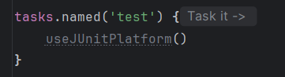

When using Kotlin DSL, you are provided a type-safe way
to configure this task:

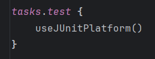

The benefit here is that you avoid having to type a 
magic string such as "test" which is prone to typos.
With Kotlin DSL, a typo for the task name would give 
a compile-time error.

## Type-safe model accessors
Kotlin DSL provides type-safe model accessors which helps
the developer catch issues earlier rather than later.

For example, if you wish to add a Gradle dependency and
accidentally misspell "imlpementation" it can be difficult
to notice this as quickly with Groovy DSL:

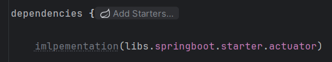

You could essentially run this project and an error would
first arise at runtime.
With Kotlin DSL, the typo would cause a compile-time error.
This means that it is easier for a developer
to find the issue as quickly as possible when
using Kotlin DSL:

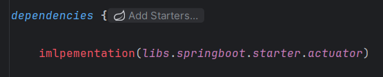

## Autocompletion

Groovy DSL does not provide as much support for autocompletion.
If you for example try to autocomplete **useJUnitPlatform()**, 
IntelliJ IDEA is unable to come up with a suggestion:

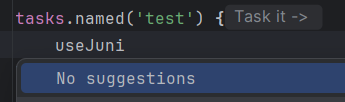

When you use Kotlin DSL, you have improved autocompletion support,
and it is able to suggest **useJUnitPlatform()** easily:

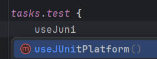

## Code documentation

Groovy DSL does not provide that much code documentation:

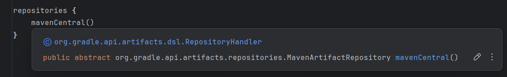

However, Kotlin DSL has improved support for code documentation:

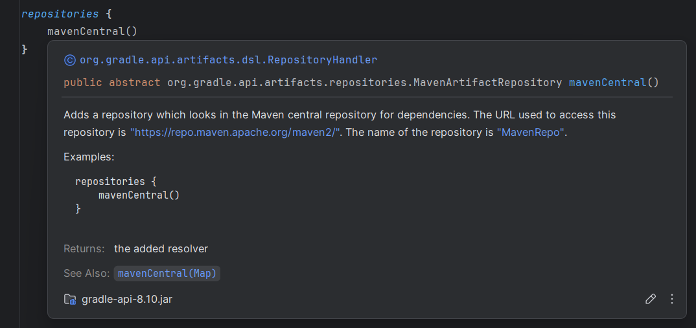

## Quick navigation

Groovy DSL does not have the best support for quick navigation.
When you for example try to Ctrl/Cmd + Click to quick-navigate to
the source of **useJUnitPlatform()** it does not work with Groovy DSL:

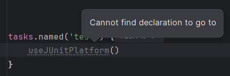

Kotlin DSL has improved quick navigation support, and you are able to
easily Ctrl/Cmd + Click to quick-navigate to easily see the source
of for example **useJUnitPlatform()**:

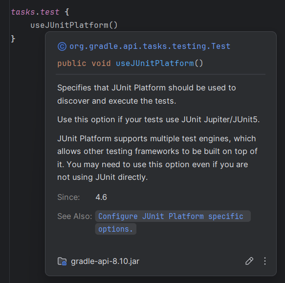
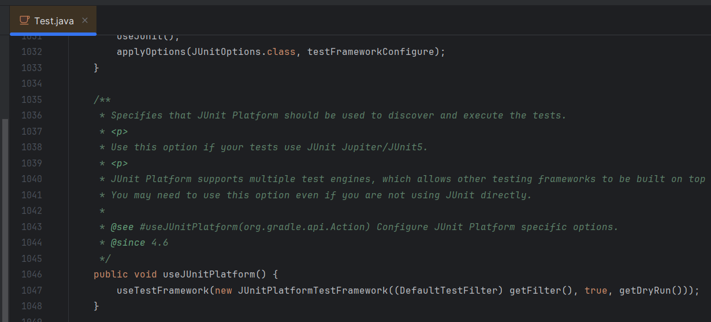

## Plugin syntax

When defining Gradle plugins using Groovy DSL,
you are required to use magic strings as such:

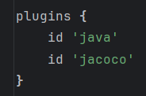

With Kotlin DSL, the plugin syntax is safer:

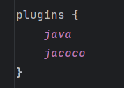

You generally want to avoid magic strings as
they are prone to errors. Kotlin DSL makes it
easier to catch an issue when defining plugins
as shown in the example images above.
